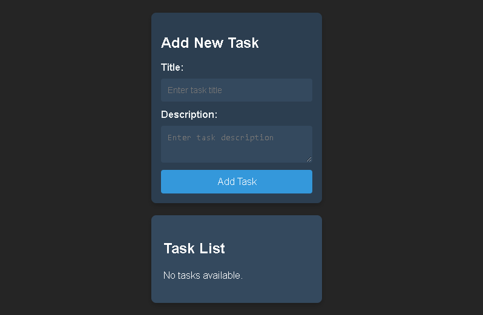

# Task Manager App

A minimalist Task Manager application built with Ruby on Rails and React, allowing you to effortlessly manage your tasks.




## Features

- Add new tasks with titles, descriptions, and due dates.
- Mark tasks as completed.
- Delete tasks you no longer need.

## Technologies Used

- **Frontend**: React, JavaScript, CSS 
- **Backend**: Ruby on Rails, PostgreSQL
- **HTTP Requests**: Axios

## How to Use

1. Install dependencies:

   ```
   bundle install
   yarn install

2. Set up the database:
    ```
   rails db:create
   rails db:migrate

3. Start the servers:
    ```
   rails server
   yarn start

4. Open http://localhost:3000 in your browser.

## License
This project is licensed under the MIT License.
